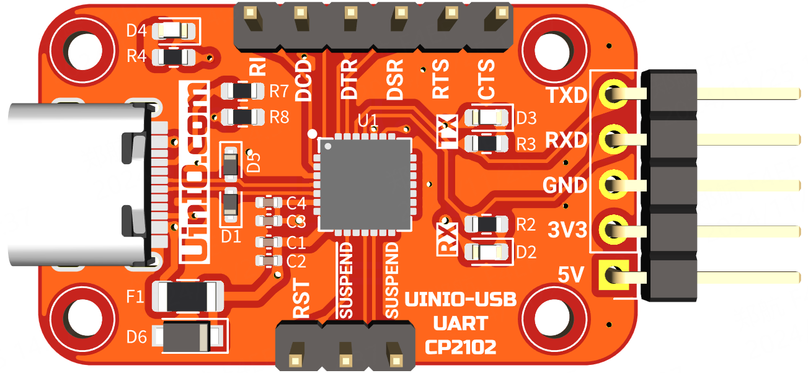
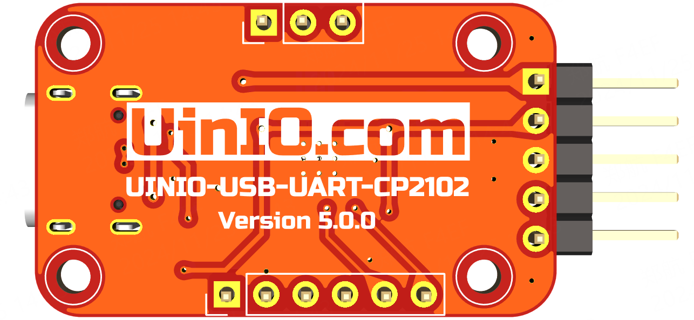

# UINIO-USB-UART-CP2102 串口调试器

[**UINIO-USB-UART-CP2102**](https://gitee.com/uinika/UINIO-USB-UART) 是一款基于 [**美国芯科 CP2102**](https://www.silabs.com/interface/usb-bridges/classic/device.cp2102) 芯片的 **USB** 转 **UART** 的开源串口调试器，该款芯片采用 `QFN28` 封装，可以稳定支持 `921600` 波特率的 UART 串口通信。

## 设计概要

1. 板载 `RXD` 和 `TXD` 的信号传输状态指示灯；
2. USB 信号线上并入了两枚 TVS 瞬态电压抑制二极管；
3. 引出了包括**串口硬件流控信号线**在内的全部片上资源；
4. 为 `5V` 输出提供了**自恢复保险丝**和**二极管**组成的防反接保护电路；
5. 预留有 `2mm` 的固定螺丝孔，便于安装至 3D 打印外壳，或者搭建成套的产品原型；

## 参考技术文档

[UinIO.com 电子技术实验室](http://uinio.com/) 为 UINIO-USB-UART 开源项目提供了如下一系列技术参考资料：

- [《BOM 交互式物料清单与 PCB 布线在线预览》](http://uinio.com/archives/BOM/UINIO-USB-UART.html)
